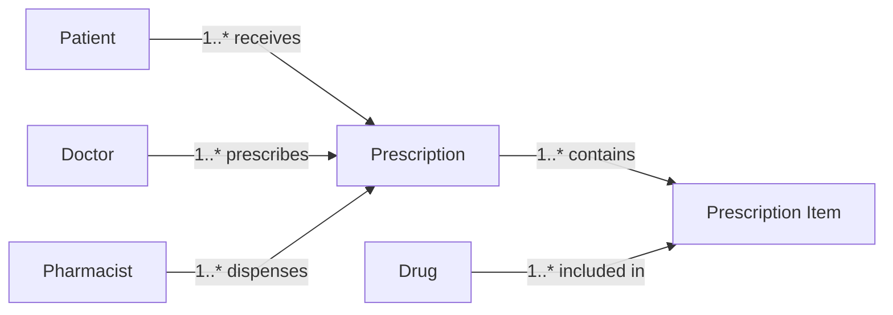
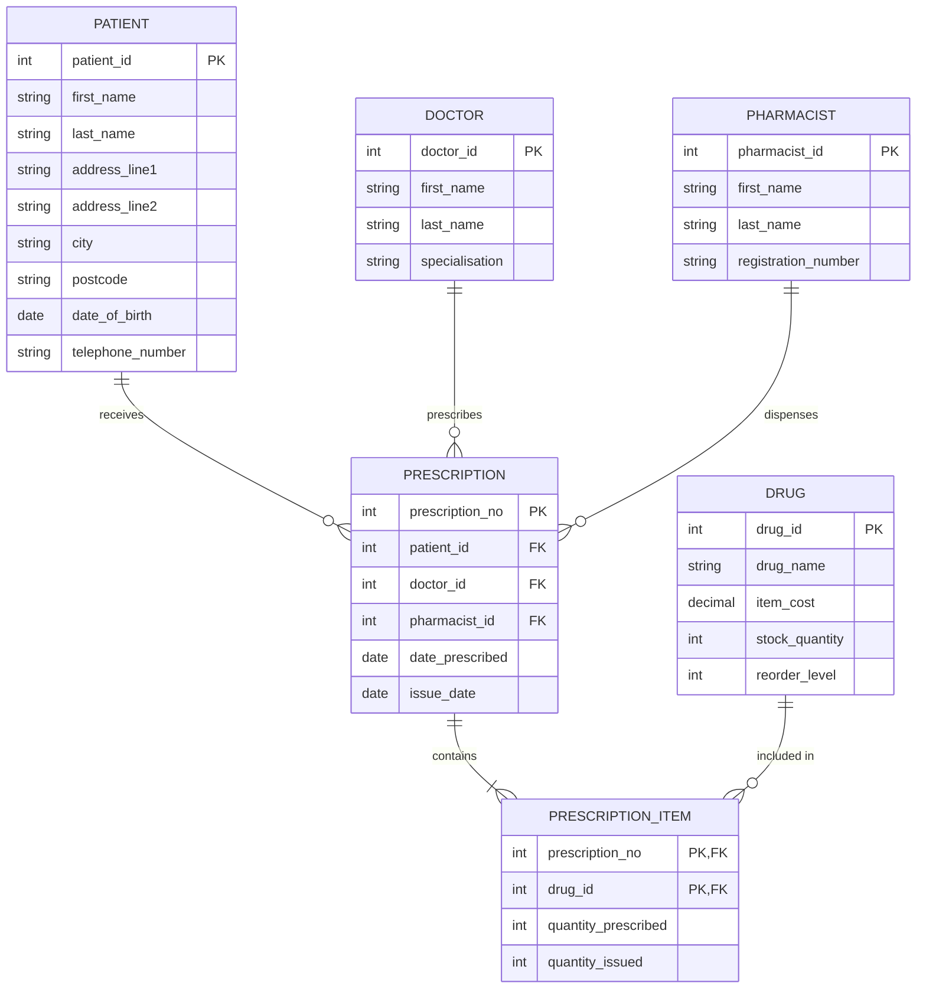

# Task 2: St. John's Hospital Pharmacy System
## Entity-Relationship Diagram and Data Dictionary

---

## Part 1: Entity-Relationship Diagram

### Diagram Description

The E-R diagram for St. John's Hospital Pharmacy System consists of six entities with the following relationships:

Paste the following into a Mermaid renderer (e.g., `https://mermaid.live/` or `mermaid.ai`) to render a clean relationship diagram (and export it as PNG/SVG for Word/web):



If you also want the **attribute list inside the diagram**, use this alternative `erDiagram` version (note: this will show crow’s-foot style connectors):



### Cardinality Relationships

<table>
  <thead>
    <tr>
      <th>Relationship</th>
      <th>Cardinality</th>
      <th>Description</th>
    </tr>
  </thead>
  <tbody>
    <tr>
      <td>PATIENT to PRESCRIPTION</td>
      <td align="center">1:M</td>
      <td>One patient can have many prescriptions; each prescription belongs to one patient</td>
    </tr>
    <tr>
      <td>DOCTOR to PRESCRIPTION</td>
      <td align="center">1:M</td>
      <td>One doctor can prescribe many prescriptions; each prescription is prescribed by one doctor</td>
    </tr>
    <tr>
      <td>PHARMACIST to PRESCRIPTION</td>
      <td align="center">1:M</td>
      <td>One pharmacist can dispense many prescriptions; each prescription is dispensed by one pharmacist</td>
    </tr>
    <tr>
      <td>PRESCRIPTION to PRESCRIPTION_ITEM</td>
      <td align="center">1:M</td>
      <td>One prescription can contain many items; each item belongs to one prescription</td>
    </tr>
    <tr>
      <td>DRUG to PRESCRIPTION_ITEM</td>
      <td align="center">1:M</td>
      <td>One drug can appear in many prescription items; each prescription item refers to one drug</td>
    </tr>
  </tbody>
</table>

### Assumptions

Assumptions made when creating the E-R diagram (based on the brief):

1. **Doctors and pharmacists are stored separately**: I’ve kept DOCTOR and PHARMACIST as their own tables (instead of just storing names on a prescription) so the same staff member can be referenced consistently across many prescriptions.

2. **One pharmacist per prescription**: Each prescription is recorded as being dispensed by one pharmacist. If, in reality, different items could be dispensed by different pharmacists, then pharmacist_id would need to move down to PRESCRIPTION_ITEM.

3. **One doctor per prescription**: Each prescription is written by one doctor, so PRESCRIPTION stores a single doctor_id.

4. **A prescription can contain multiple drugs**: This is why PRESCRIPTION_ITEM exists as the “line items” table linking prescriptions to drugs with quantities.

5. **Stock control is included**: DRUG keeps stock_quantity and reorder_level so the pharmacy can track stock and know when to reorder, as described in the scenario.

6. **Patient address is split into fields**: I’ve stored the address as address_line1, address_line2, city and postcode to make searching/filtering easier (rather than one long address field).

7. **Prescribed date vs issue date**: date_prescribed is when the doctor wrote it; issue_date is when it was actually dispensed. These can be different.

8. **Prescribed quantity can differ from issued quantity**: quantity_prescribed and quantity_issued are stored separately because the pharmacy might only be able to issue part of the prescription (e.g., low stock).

9. **Patient identifier**: The brief mentions an “ID number”, so patient_id is used as the primary key (this could represent an NHS number or a hospital-specific ID).

---

## Part 2: Data Dictionary

### Table: PATIENT

<table>
  <thead>
    <tr>
      <th>Attribute name</th>
      <th>Data type</th>
      <th>Length</th>
      <th>Required</th>
      <th>Validation / constraints</th>
      <th>Format</th>
      <th>PK</th>
      <th>FK</th>
      <th>Comments</th>
    </tr>
  </thead>
  <tbody>
    <tr><td><code>patient_id</code></td><td><code>SERIAL</code></td><td align="center">—</td><td align="center">Y</td><td>Auto-increment</td><td align="center">—</td><td align="center">Y</td><td align="center">—</td><td>Unique patient identifier (e.g., hospital ID / NHS number surrogate)</td></tr>
    <tr><td><code>first_name</code></td><td><code>VARCHAR</code></td><td align="center">50</td><td align="center">Y</td><td>Not null</td><td align="center">—</td><td align="center"></td><td align="center">—</td><td>Patient first name</td></tr>
    <tr><td><code>last_name</code></td><td><code>VARCHAR</code></td><td align="center">50</td><td align="center">Y</td><td>Not null</td><td align="center">—</td><td align="center"></td><td align="center">—</td><td>Patient surname</td></tr>
    <tr><td><code>address_line1</code></td><td><code>VARCHAR</code></td><td align="center">100</td><td align="center">Y</td><td>Not null</td><td align="center">—</td><td align="center"></td><td align="center">—</td><td>Address line 1</td></tr>
    <tr><td><code>address_line2</code></td><td><code>VARCHAR</code></td><td align="center">100</td><td align="center">N</td><td>Nullable</td><td align="center">—</td><td align="center"></td><td align="center">—</td><td>Address line 2 (optional)</td></tr>
    <tr><td><code>city</code></td><td><code>VARCHAR</code></td><td align="center">50</td><td align="center">Y</td><td>Not null</td><td align="center">—</td><td align="center"></td><td align="center">—</td><td>City / town</td></tr>
    <tr><td><code>postcode</code></td><td><code>VARCHAR</code></td><td align="center">8</td><td align="center">Y</td><td>Not null</td><td>UK postcode</td><td align="center"></td><td align="center">—</td><td>Postal code</td></tr>
    <tr><td><code>date_of_birth</code></td><td><code>DATE</code></td><td align="center">—</td><td align="center">Y</td><td>Must be in the past</td><td><code>DD-MON-YYYY</code></td><td align="center"></td><td align="center">—</td><td>Date of birth</td></tr>
    <tr><td><code>telephone_number</code></td><td><code>VARCHAR</code></td><td align="center">11</td><td align="center">Y</td><td>Not null</td><td>Digits</td><td align="center"></td><td align="center">—</td><td>Contact number (UK style)</td></tr>
  </tbody>
</table>

---

### Table: DOCTOR

<table>
  <thead>
    <tr>
      <th>Attribute name</th>
      <th>Data type</th>
      <th>Length</th>
      <th>Required</th>
      <th>Validation / constraints</th>
      <th>Format</th>
      <th>PK</th>
      <th>FK</th>
      <th>Comments</th>
    </tr>
  </thead>
  <tbody>
    <tr><td><code>doctor_id</code></td><td><code>SERIAL</code></td><td align="center">—</td><td align="center">Y</td><td>Auto-increment</td><td align="center">—</td><td align="center">Y</td><td align="center">—</td><td>Unique doctor identifier</td></tr>
    <tr><td><code>first_name</code></td><td><code>VARCHAR</code></td><td align="center">50</td><td align="center">Y</td><td>Not null</td><td align="center">—</td><td align="center"></td><td align="center">—</td><td>Doctor first name</td></tr>
    <tr><td><code>last_name</code></td><td><code>VARCHAR</code></td><td align="center">50</td><td align="center">Y</td><td>Not null</td><td align="center">—</td><td align="center"></td><td align="center">—</td><td>Doctor surname</td></tr>
    <tr><td><code>specialisation</code></td><td><code>VARCHAR</code></td><td align="center">100</td><td align="center">N</td><td>Nullable</td><td align="center">—</td><td align="center"></td><td align="center">—</td><td>Optional specialism</td></tr>
  </tbody>
</table>

---

### Table: PHARMACIST

<table>
  <thead>
    <tr>
      <th>Attribute name</th>
      <th>Data type</th>
      <th>Length</th>
      <th>Required</th>
      <th>Validation / constraints</th>
      <th>Format</th>
      <th>PK</th>
      <th>FK</th>
      <th>Comments</th>
    </tr>
  </thead>
  <tbody>
    <tr><td><code>pharmacist_id</code></td><td><code>SERIAL</code></td><td align="center">—</td><td align="center">Y</td><td>Auto-increment</td><td align="center">—</td><td align="center">Y</td><td align="center">—</td><td>Unique pharmacist identifier</td></tr>
    <tr><td><code>first_name</code></td><td><code>VARCHAR</code></td><td align="center">50</td><td align="center">Y</td><td>Not null</td><td align="center">—</td><td align="center"></td><td align="center">—</td><td>Pharmacist first name</td></tr>
    <tr><td><code>last_name</code></td><td><code>VARCHAR</code></td><td align="center">50</td><td align="center">Y</td><td>Not null</td><td align="center">—</td><td align="center"></td><td align="center">—</td><td>Pharmacist surname</td></tr>
    <tr><td><code>registration_number</code></td><td><code>VARCHAR</code></td><td align="center">20</td><td align="center">Y</td><td>Not null; unique</td><td align="center">—</td><td align="center"></td><td align="center">—</td><td>GPhC registration number</td></tr>
  </tbody>
</table>

---

### Table: DRUG

<table>
  <thead>
    <tr>
      <th>Attribute name</th>
      <th>Data type</th>
      <th>Length</th>
      <th>Required</th>
      <th>Validation / constraints</th>
      <th>Format</th>
      <th>PK</th>
      <th>FK</th>
      <th>Comments</th>
    </tr>
  </thead>
  <tbody>
    <tr><td><code>drug_id</code></td><td><code>SERIAL</code></td><td align="center">—</td><td align="center">Y</td><td>Auto-increment</td><td align="center">—</td><td align="center">Y</td><td align="center">—</td><td>Unique drug identifier</td></tr>
    <tr><td><code>drug_name</code></td><td><code>VARCHAR</code></td><td align="center">100</td><td align="center">Y</td><td>Not null</td><td align="center">—</td><td align="center"></td><td align="center">—</td><td>Medication name</td></tr>
    <tr><td><code>item_cost</code></td><td><code>NUMERIC</code></td><td align="center">8,2</td><td align="center">Y</td><td>&gt;= 0</td><td>999999.99</td><td align="center"></td><td align="center">—</td><td>Cost per unit (GBP)</td></tr>
    <tr><td><code>stock_quantity</code></td><td><code>INTEGER</code></td><td align="center">—</td><td align="center">Y</td><td>&gt;= 0</td><td align="center">—</td><td align="center"></td><td align="center">—</td><td>Current stock</td></tr>
    <tr><td><code>reorder_level</code></td><td><code>INTEGER</code></td><td align="center">—</td><td align="center">Y</td><td>&gt;= 0</td><td align="center">—</td><td align="center"></td><td align="center">—</td><td>Reorder threshold</td></tr>
  </tbody>
</table>

---

### Table: PRESCRIPTION

<table>
  <thead>
    <tr>
      <th>Attribute name</th>
      <th>Data type</th>
      <th>Length</th>
      <th>Required</th>
      <th>Validation / constraints</th>
      <th>Format</th>
      <th>PK</th>
      <th>FK</th>
      <th>Comments</th>
    </tr>
  </thead>
  <tbody>
    <tr><td><code>prescription_no</code></td><td><code>SERIAL</code></td><td align="center">—</td><td align="center">Y</td><td>Auto-increment</td><td align="center">—</td><td align="center">Y</td><td align="center">—</td><td>Unique prescription number</td></tr>
    <tr><td><code>patient_id</code></td><td><code>INTEGER</code></td><td align="center">—</td><td align="center">Y</td><td>Not null</td><td align="center">—</td><td align="center"></td><td><code>patient.patient_id</code></td><td>Patient receiving prescription</td></tr>
    <tr><td><code>doctor_id</code></td><td><code>INTEGER</code></td><td align="center">—</td><td align="center">Y</td><td>Not null</td><td align="center">—</td><td align="center"></td><td><code>doctor.doctor_id</code></td><td>Prescribing doctor</td></tr>
    <tr><td><code>pharmacist_id</code></td><td><code>INTEGER</code></td><td align="center">—</td><td align="center">Y</td><td>Not null</td><td align="center">—</td><td align="center"></td><td><code>pharmacist.pharmacist_id</code></td><td>Dispensing pharmacist</td></tr>
    <tr><td><code>date_prescribed</code></td><td><code>DATE</code></td><td align="center">—</td><td align="center">Y</td><td>Not null</td><td><code>DD-MON-YYYY</code></td><td align="center"></td><td align="center">—</td><td>Date written by doctor</td></tr>
    <tr><td><code>issue_date</code></td><td><code>DATE</code></td><td align="center">—</td><td align="center">N</td><td>Nullable; if present must be &gt;= date_prescribed</td><td><code>DD-MON-YYYY</code></td><td align="center"></td><td align="center">—</td><td>Date dispensed by pharmacist</td></tr>
  </tbody>
</table>

---

### Table: PRESCRIPTION_ITEM

<table>
  <thead>
    <tr>
      <th>Attribute name</th>
      <th>Data type</th>
      <th>Length</th>
      <th>Required</th>
      <th>Validation / constraints</th>
      <th>Format</th>
      <th>PK</th>
      <th>FK</th>
      <th>Comments</th>
    </tr>
  </thead>
  <tbody>
    <tr><td><code>prescription_no</code></td><td><code>INTEGER</code></td><td align="center">—</td><td align="center">Y</td><td>Not null</td><td align="center">—</td><td align="center">Y</td><td><code>prescription.prescription_no</code></td><td>Composite PK (part 1)</td></tr>
    <tr><td><code>drug_id</code></td><td><code>INTEGER</code></td><td align="center">—</td><td align="center">Y</td><td>Not null</td><td align="center">—</td><td align="center">Y</td><td><code>drug.drug_id</code></td><td>Composite PK (part 2)</td></tr>
    <tr><td><code>quantity_prescribed</code></td><td><code>INTEGER</code></td><td align="center">—</td><td align="center">Y</td><td>&gt; 0</td><td align="center">—</td><td align="center"></td><td align="center">—</td><td>Units prescribed</td></tr>
    <tr><td><code>quantity_issued</code></td><td><code>INTEGER</code></td><td align="center">—</td><td align="center">Y</td><td>0 &lt;= issued &lt;= prescribed</td><td align="center">—</td><td align="center"></td><td align="center">—</td><td>Units dispensed (may be partial)</td></tr>
  </tbody>
</table>

---

## Summary of Entity Relationships

<table>
  <thead>
    <tr>
      <th>Parent</th>
      <th>Child</th>
      <th>Foreign key (in child)</th>
      <th>Cardinality</th>
    </tr>
  </thead>
  <tbody>
    <tr><td><code>PATIENT</code></td><td><code>PRESCRIPTION</code></td><td><code>patient_id</code></td><td align="center">1 : M</td></tr>
    <tr><td><code>DOCTOR</code></td><td><code>PRESCRIPTION</code></td><td><code>doctor_id</code></td><td align="center">1 : M</td></tr>
    <tr><td><code>PHARMACIST</code></td><td><code>PRESCRIPTION</code></td><td><code>pharmacist_id</code></td><td align="center">1 : M</td></tr>
    <tr><td><code>PRESCRIPTION</code></td><td><code>PRESCRIPTION_ITEM</code></td><td><code>prescription_no</code></td><td align="center">1 : M</td></tr>
    <tr><td><code>DRUG</code></td><td><code>PRESCRIPTION_ITEM</code></td><td><code>drug_id</code></td><td align="center">1 : M</td></tr>
  </tbody>
</table>

---

## PostgreSQL CREATE TABLE Statements (Reference)

```sql
-- Create PATIENT table
CREATE TABLE patient (
    patient_id SERIAL PRIMARY KEY,
    first_name VARCHAR(50) NOT NULL,
    last_name VARCHAR(50) NOT NULL,
    address_line1 VARCHAR(100) NOT NULL,
    address_line2 VARCHAR(100),
    city VARCHAR(50) NOT NULL,
    postcode VARCHAR(8) NOT NULL,
    date_of_birth DATE NOT NULL CHECK (date_of_birth < CURRENT_DATE),
    telephone_number VARCHAR(11) NOT NULL
);

-- Create DOCTOR table
CREATE TABLE doctor (
    doctor_id SERIAL PRIMARY KEY,
    first_name VARCHAR(50) NOT NULL,
    last_name VARCHAR(50) NOT NULL,
    specialisation VARCHAR(100)
);

-- Create PHARMACIST table
CREATE TABLE pharmacist (
    pharmacist_id SERIAL PRIMARY KEY,
    first_name VARCHAR(50) NOT NULL,
    last_name VARCHAR(50) NOT NULL,
    registration_number VARCHAR(20) NOT NULL UNIQUE
);

-- Create DRUG table
CREATE TABLE drug (
    drug_id SERIAL PRIMARY KEY,
    drug_name VARCHAR(100) NOT NULL,
    item_cost NUMERIC(8,2) NOT NULL CHECK (item_cost >= 0),
    stock_quantity INTEGER NOT NULL CHECK (stock_quantity >= 0),
    reorder_level INTEGER NOT NULL CHECK (reorder_level >= 0)
);

-- Create PRESCRIPTION table
CREATE TABLE prescription (
    prescription_no SERIAL PRIMARY KEY,
    patient_id INTEGER NOT NULL REFERENCES patient(patient_id),
    doctor_id INTEGER NOT NULL REFERENCES doctor(doctor_id),
    pharmacist_id INTEGER NOT NULL REFERENCES pharmacist(pharmacist_id),
    date_prescribed DATE NOT NULL,
    issue_date DATE CHECK (issue_date >= date_prescribed)
);

-- Create PRESCRIPTION_ITEM table
CREATE TABLE prescription_item (
    prescription_no INTEGER NOT NULL REFERENCES prescription(prescription_no),
    drug_id INTEGER NOT NULL REFERENCES drug(drug_id),
    quantity_prescribed INTEGER NOT NULL CHECK (quantity_prescribed > 0),
    quantity_issued INTEGER NOT NULL CHECK (quantity_issued >= 0),
    PRIMARY KEY (prescription_no, drug_id),
    CHECK (quantity_issued <= quantity_prescribed)
);
```

