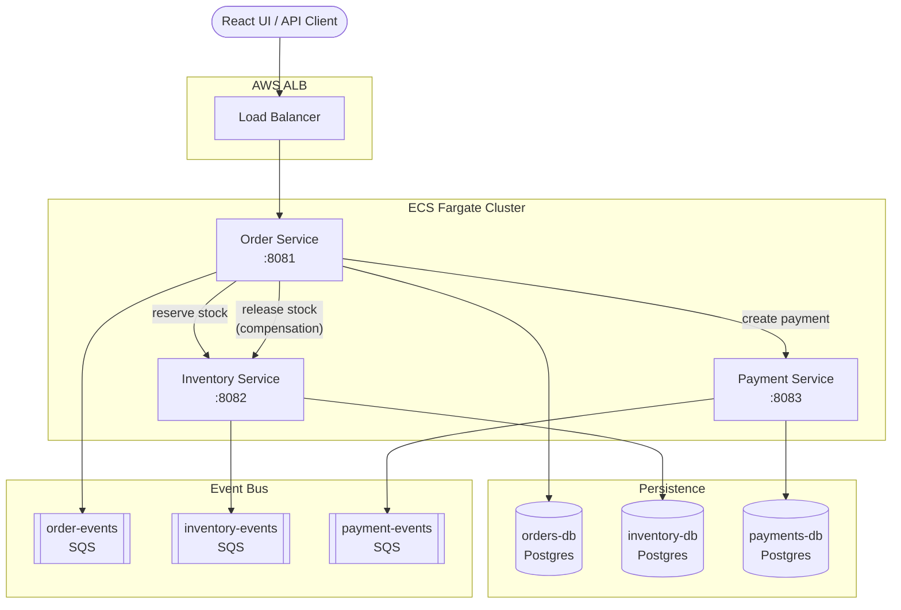

# Java Order Microservices

A distributed order management system built with Spring Boot, demonstrating microservice patterns including saga-based orchestration, idempotent operations, circuit breakers, and event-driven communication via AWS SQS.

## Architecture



**Order confirmation flow:** Order Service orchestrates a saga — it reserves inventory, then requests payment. If payment fails, it compensates by releasing the reserved stock. Each downstream call is idempotent so retries are safe.

## Services

| Service | Port | Responsibility |
|---------|------|----------------|
| **order-service** | 8081 | JWT auth, order lifecycle, saga orchestration |
| **inventory-service** | 8082 | Stock levels, pessimistic-locked reservations |
| **payment-service** | 8083 | Mock payment gateway (declines amounts > 1000) |
| **web-ui** | 5173 | React + TypeScript dashboard with live service flow visualization |

Each service owns its own Postgres database and Flyway migrations — no shared data stores.

## Quick start

```bash
docker compose up --build
```

Then open `http://localhost:5173` for the web UI, or use the API directly:

```bash
# Get a JWT
TOKEN=$(curl -s -X POST http://localhost:8081/auth/token \
  -H 'Content-Type: application/json' \
  -d '{"username":"customer","password":"password"}' | jq -r '.accessToken')

# Create an order
curl -s -X POST http://localhost:8081/orders \
  -H "Authorization: Bearer $TOKEN" \
  -H 'Content-Type: application/json' \
  -d '{"items":[{"sku":"SKU-APPLE","quantity":2}]}'

# Confirm (reserves stock → processes payment)
curl -s -X POST http://localhost:8081/orders/{id}/confirm \
  -H "Authorization: Bearer $TOKEN"

# Cancel (compensates by releasing reserved stock)
curl -s -X POST http://localhost:8081/orders/{id}/cancel \
  -H "Authorization: Bearer $TOKEN"
```

Swagger UI is available on each service: [order](http://localhost:8081/swagger-ui.html) · [inventory](http://localhost:8082/swagger-ui.html) · [payment](http://localhost:8083/swagger-ui.html)

## Design decisions

**Saga orchestration over choreography.** The order service explicitly calls inventory and payment in sequence, then compensates on failure. This makes the order lifecycle easy to follow and debug, compared to a purely event-driven choreography where flow control is scattered across consumers. Events are still published (to SQS) for observability and downstream consumers, but they don't drive the core flow.

**Idempotent operations.** Both inventory reservations and payments are keyed by `orderId`. Repeating a reserve or payment call returns the existing result rather than creating a duplicate. This makes retries safe and removes the need for exactly-once delivery guarantees from the message broker.

**Pessimistic locking + optimistic versioning on inventory.** Reservation requests acquire a `SELECT ... FOR UPDATE` lock on inventory rows to prevent overselling under concurrent requests, while a `@Version` column provides an additional safety net against stale writes. This dual approach is deliberate — the pessimistic lock handles the common case efficiently, while optimistic versioning catches edge cases.

**Separate database per service.** Each microservice owns its schema and migrations (via Flyway). There are no cross-service joins or shared tables. This enforces loose coupling and means each service can evolve its schema independently.

**Circuit breakers on inter-service calls.** Resilience4j circuit breakers on the inventory and payment clients prevent cascading failures. If a downstream service is unhealthy, the circuit opens and requests fail fast instead of consuming threads waiting for timeouts.

**HTTP call outside the `@Transactional` boundary.** The price-lookup call to inventory-service happens before the database transaction opens in `OrderService.create()`. This avoids holding a database connection while waiting on a network call — a common anti-pattern in Spring applications.

## Testing

```bash
cd order-service && ./gradlew test    # Integration tests (requires Docker for Testcontainers)
cd inventory-service && ./gradlew test  # Unit tests
cd payment-service && ./gradlew test    # Unit tests
```

The order-service integration test uses Testcontainers (Postgres) and WireMock (downstream services) to verify the full order lifecycle: creation, confirmation, cancellation, payment failure with stock release, and idempotent conflict handling.

Inventory and payment services have unit tests covering happy paths, edge cases, idempotency, and boundary conditions.

## Infrastructure

Terraform configuration in `infra/terraform/` provisions a complete AWS environment: VPC, ECS Fargate cluster with service discovery, ALB, RDS Postgres instances, SQS queues, Secrets Manager, and IAM roles. See `infra/terraform/README.md` for setup instructions.

CI/CD pipelines in `.github/workflows/`:

- **ci.yml** — runs tests on every push and PR
- **deploy-ecs.yml** — builds Docker images, pushes to ECR, and deploys to ECS on merge to main

## Tech stack

Java 21, Spring Boot 3.5, Spring Security (OAuth2 Resource Server / JWT), Spring Data JPA, Flyway, Resilience4j, AWS SQS, Testcontainers, WireMock, PostgreSQL, React 18, TypeScript, Vite, Docker Compose, Terraform, GitHub Actions.

## Notes

- The inventory DB is seeded with a few SKUs (see `inventory-service` Flyway migrations).
- Payment is a mock: amounts > 1000.00 are declined.
- Authentication uses a hardcoded user store for the demo. In production this would be backed by Spring Security's `UserDetailsService` or an external identity provider.
- The build is configured for Java 21 (LTS). You can change all `build.gradle` toolchains + Dockerfiles to Java 17 if you prefer.
