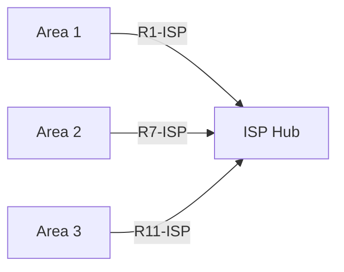

# Network Diagram Generation Guide

## Overview

This guide explains how to generate professional network diagrams from the addressing schemes.

---

## 📊 Available Diagram Options

### 1. **Mermaid Diagrams** (✅ Ready to Use!)
- **File:** `Mermaid_Diagrams.md`
- **Format:** Text-based, renders in markdown viewers
- **Tools:** GitHub, VS Code, Obsidian, online viewers
- **Pros:** No installation required, version control friendly
- **Cons:** Limited customization

### 2. **Python/Graphviz Diagrams** (🔧 Requires Setup)
- **File:** `generate_network_diagrams.py`
- **Format:** PNG, SVG, PDF
- **Tools:** Python + Graphviz
- **Pros:** Professional quality, highly customizable
- **Cons:** Requires installation

### 3. **CSV/Excel Files** (✅ Ready to Use!)
- **Files:** `IPv4_Address_Plan.csv`, `IPv6_Address_Plan.csv`
- **Format:** Spreadsheet
- **Tools:** Excel, Google Sheets, LibreOffice
- **Pros:** Easy to edit, filter, sort
- **Cons:** Manual diagram creation

### 4. **Packet Tracer** (Manual Import)
- Use CSV files to manually configure devices
- Create visual topology in Packet Tracer
- Export as PNG from Packet Tracer

---

## 🚀 Quick Start: Mermaid Diagrams

### Option A: View in VS Code
1. Install extension: "Markdown Preview Mermaid Support"
2. Open `Mermaid_Diagrams.md`
3. Press `Ctrl+Shift+V` (Windows) or `Cmd+Shift+V` (Mac)
4. Diagrams render automatically!

### Option B: View on GitHub
1. Push files to GitHub repository
2. Open `Mermaid_Diagrams.md` in browser
3. Diagrams render automatically!

### Option C: Export as Images
1. Go to https://mermaid.live/
2. Copy diagram code from `Mermaid_Diagrams.md`
3. Paste into editor
4. Click "Download PNG" or "Download SVG"

**Example:**


---

## 🐍 Advanced: Python/Graphviz Diagrams

### Step 1: Install Requirements

#### Windows:
```powershell
# Install Python package
pip install graphviz

# Install Graphviz software (choose one):
# Option 1: Using Chocolatey
choco install graphviz

# Option 2: Download installer
# Visit: https://graphviz.org/download/
# Download and run Windows installer
```

#### macOS:
```bash
# Install Python package
pip install graphviz

# Install Graphviz software
brew install graphviz
```

#### Linux (Ubuntu/Debian):
```bash
# Install Python package
pip install graphviz

# Install Graphviz software
sudo apt-get update
sudo apt-get install graphviz
```

### Step 2: Generate Diagrams

```powershell
# Navigate to folder
cd "C:\Users\John\Documents\Comp Sci Msc\web\it3\prom06"

# Run generator
python generate_network_diagrams.py
```

### Step 3: View Output

Diagrams will be saved in `network_diagrams/` folder:
- `Network_Overview.png` - High-level view
- `IPv4_Network_Topology.png` - Detailed IPv4 diagram
- `IPv6_Network_Topology.png` - Detailed IPv6 diagram

---

## 📈 Using CSV Files

### Open in Excel/Google Sheets

1. **Open file:** `IPv4_Address_Plan.csv` or `IPv6_Address_Plan.csv`
2. **Filter by Area:** Use filter to focus on specific area
3. **Sort by Device:** Group all interfaces per device
4. **Create Pivot Tables:** Summarize by VLAN, area, etc.

### Import to Network Documentation Tools

Many network documentation tools support CSV import:
- **NetBox:** Network IPAM system
- **Device42:** IT asset management
- **IP Address Manager (IPAM):** Various tools
- **Network Notepad:** Diagram tool

### Create Diagrams in Excel

1. Open CSV file
2. Use SmartArt or Shapes to create network topology
3. Reference IP addresses from spreadsheet
4. Export as image

---

## 🎨 Creating Custom Diagrams

### Option 1: Draw.io (diagrams.net)

1. Go to https://app.diagrams.net/
2. Create new diagram
3. Use network shapes library
4. Reference addressing from documentation
5. Export as PNG/SVG/PDF

**Tips:**
- Use "Network" shape library
- Color-code by area (match our color scheme)
- Add IP addresses as labels
- Save as .drawio for future editing

### Option 2: Microsoft Visio

1. Open Visio
2. New diagram → Network
3. Drag routers/switches from stencils
4. Add IP address labels
5. Import data from CSV (Data → Link Data to Shapes)

### Option 3: Lucidchart

1. Go to https://lucid.app/
2. New document → Network diagram
3. Use network shapes
4. Reference CSV files for addresses
5. Export as image

### Option 4: Cisco Packet Tracer

1. Open Packet Tracer
2. Create network topology visually
3. Configure devices using CSV data
4. Export topology as PNG:
   - File → Export → Export as Image

---

## 🎯 Recommended Workflow

### For Quick Documentation:
1. ✅ Use **Mermaid diagrams** in `Mermaid_Diagrams.md`
2. View in VS Code or GitHub
3. Export specific diagrams to PNG if needed

### For Professional Presentations:
1. Install Graphviz
2. Run `generate_network_diagrams.py`
3. Use generated PNG files in presentations

### For Network Implementation:
1. Use CSV files in Excel/Sheets
2. Filter by area/device during configuration
3. Create Packet Tracer topology for testing

### For Interactive Documentation:
1. Import CSV to NetBox or similar IPAM
2. Generate interactive network documentation
3. Link to other systems

---

## 📋 Diagram Comparison

| Method | Quality | Effort | Tools Needed | Best For |
|--------|---------|--------|--------------|----------|
| **Mermaid** | Good | Low | Text editor | Quick docs, GitHub |
| **Graphviz** | Excellent | Medium | Python setup | Professional output |
| **Draw.io** | Excellent | High | Browser | Custom layouts |
| **Visio** | Excellent | High | MS Visio | Enterprise docs |
| **Packet Tracer** | Good | Very High | Cisco PT | Implementation |
| **CSV** | N/A | Low | Excel | Data reference |

---

## 🎨 Color Coding Guide

Use these colors to match the original scheme:

### IPv4 Diagrams:
- **Routers:** `#E8F4F8` (Light Blue)
- **Switches:** `#FFF4E6` (Light Orange)
- **VLANs/PCs:** `#E8F5E9` (Light Green)
- **ISP:** `#FFE6E6` (Light Red)

### IPv6 Diagrams:
- **Routers:** `#E1F5FE` (Light Blue)
- **Switches:** `#FFF9C4` (Light Yellow)
- **VLANs/PCs:** `#F1F8E9` (Light Green)
- **ISP:** `#FFEBEE` (Light Red)

### Area Colors:
- **Area 1:** `#B3E5FC` (Blue)
- **Area 2:** `#C8E6C9` (Green)
- **Area 3:** `#FFCCBC` (Orange)

---

## 🔧 Troubleshooting

### Graphviz: "dot command not found"

**Problem:** Python package installed but Graphviz executables not in PATH

**Solution:**
1. Verify Graphviz installed: `where dot` (Windows) or `which dot` (Mac/Linux)
2. If not found, reinstall Graphviz software (not just Python package)
3. Add to PATH manually if needed:
   - Windows: Add `C:\Program Files\Graphviz\bin` to PATH
   - Restart terminal

### Mermaid not rendering in VS Code

**Problem:** Diagrams show as code blocks

**Solution:**
1. Install extension: "Markdown Preview Mermaid Support"
2. Restart VS Code
3. Open preview with `Ctrl+Shift+V`

### CSV files not opening correctly

**Problem:** All data in one column

**Solution:**
1. Open Excel/Sheets
2. Use "Import Data" or "Open and Transform"
3. Specify comma as delimiter
4. Set UTF-8 encoding

### Python script errors

**Problem:** Import errors or graphviz not found

**Solution:**
```powershell
# Install/upgrade packages
pip install --upgrade graphviz

# Test import
python -c "import graphviz; print('OK')"

# Check graphviz executables
where dot  # Windows
which dot  # Mac/Linux
```

---

## 📚 Additional Resources

### Diagram Tools:
- **Mermaid Live Editor:** https://mermaid.live/
- **Draw.io:** https://app.diagrams.net/
- **Graphviz:** https://graphviz.org/
- **Lucidchart:** https://lucid.app/
- **Network Notepad:** http://www.networknotepad.com/

### Documentation:
- **Mermaid Syntax:** https://mermaid.js.org/
- **Graphviz Guide:** https://graphviz.org/documentation/
- **Network Diagramming Best Practices:** Various online resources

### IPAM Tools:
- **NetBox:** https://netbox.dev/
- **phpIPAM:** https://phpipam.net/
- **Device42:** https://www.device42.com/

---

## 💡 Tips for Best Results

### General Tips:
1. **Start simple** - Use Mermaid for quick diagrams
2. **Be consistent** - Use same colors/styles throughout
3. **Label everything** - IP addresses, VLANs, interface names
4. **Show hierarchy** - Group by area/function
5. **Keep updated** - Regenerate when addresses change

### For Large Networks:
1. **Create multiple views** - Overview + detailed per area
2. **Use layers** - Physical, logical, addressing
3. **Focus diagrams** - One diagram per purpose
4. **Document legend** - Explain symbols and colors

### For Presentations:
1. **High resolution** - Export as SVG or high-DPI PNG
2. **Clear labels** - Large enough to read
3. **Progressive disclosure** - Show overview first, then details
4. **Animate** - Show network build-up step by step

---

## ✅ Next Steps

### Immediate Actions:
1. ✅ Open `Mermaid_Diagrams.md` in VS Code
2. ✅ Install Mermaid preview extension
3. ✅ View diagrams

### Optional Advanced:
1. Install Graphviz if you want high-quality PNG outputs
2. Run Python script to generate professional diagrams
3. Import CSV to your preferred network tool

### For Implementation:
1. Use CSV files during device configuration
2. Create Packet Tracer topology for testing
3. Keep diagrams updated as network evolves

---

*Diagram Generation Guide v1.0 | October 26, 2025*

