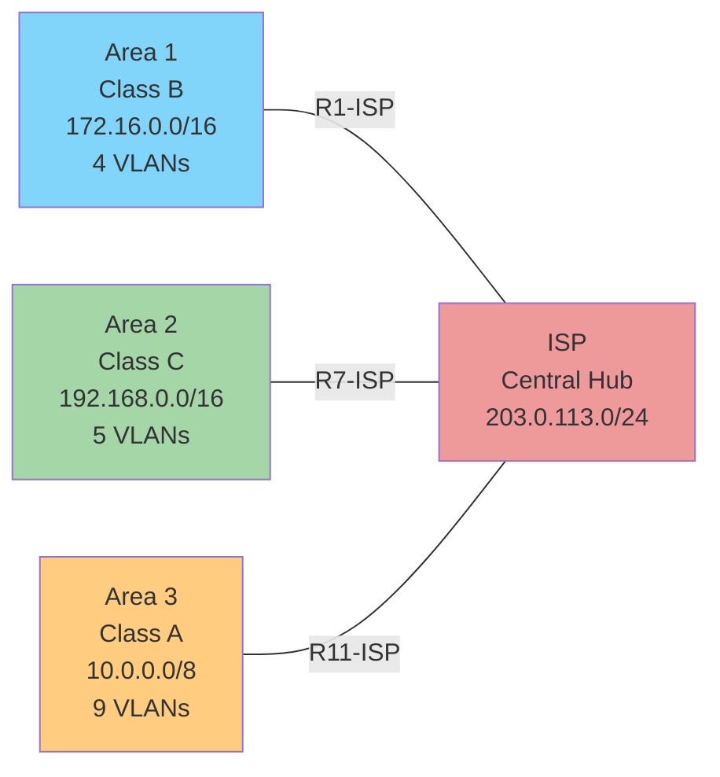
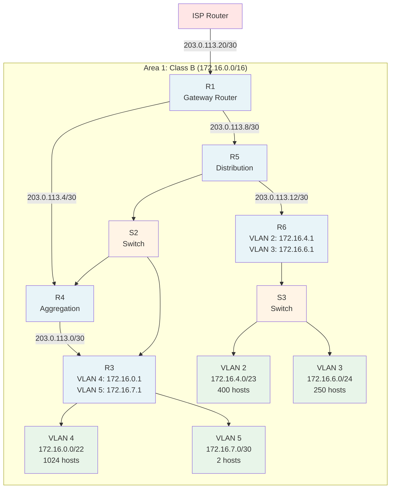
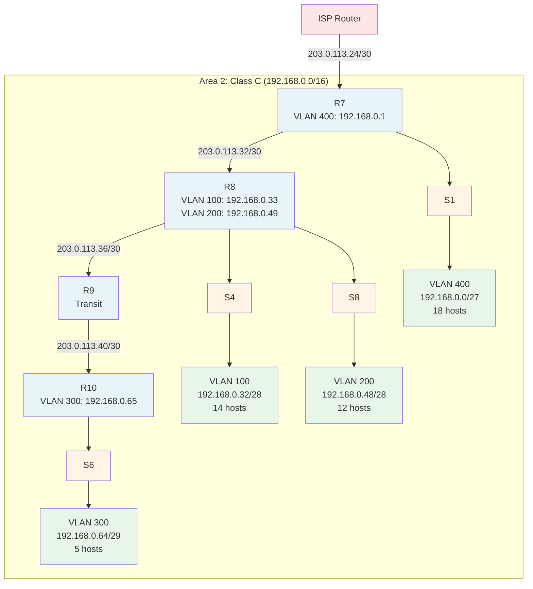
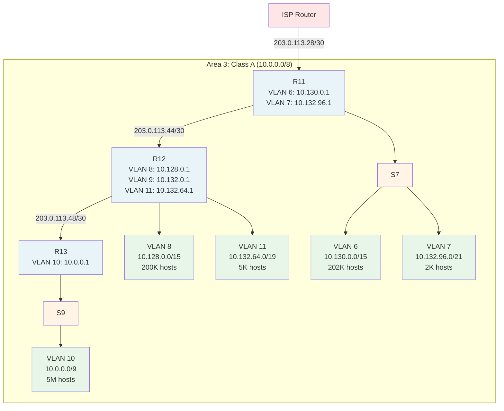
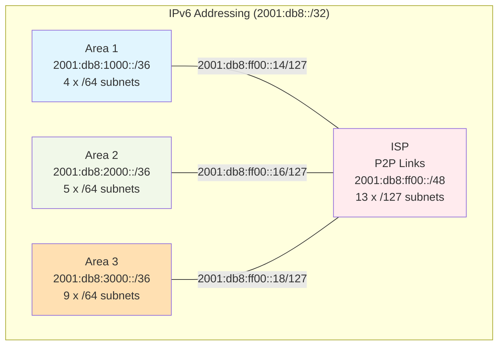
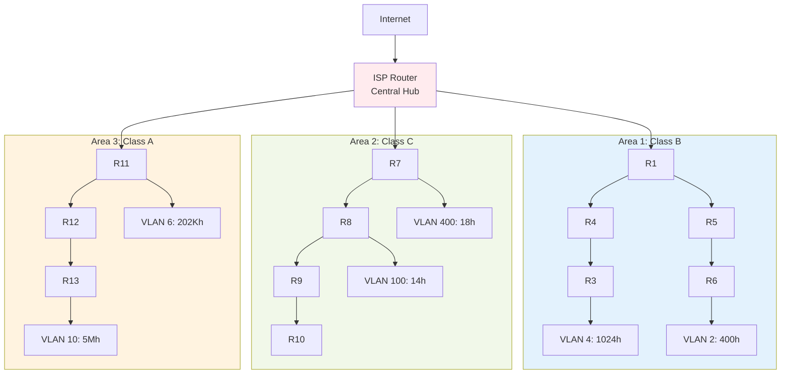
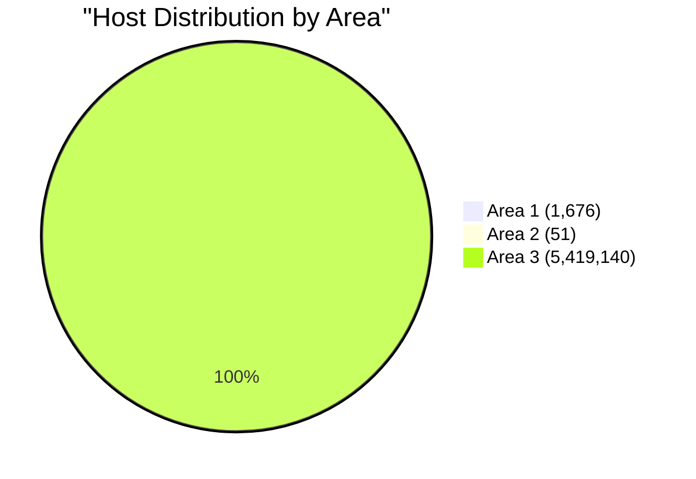
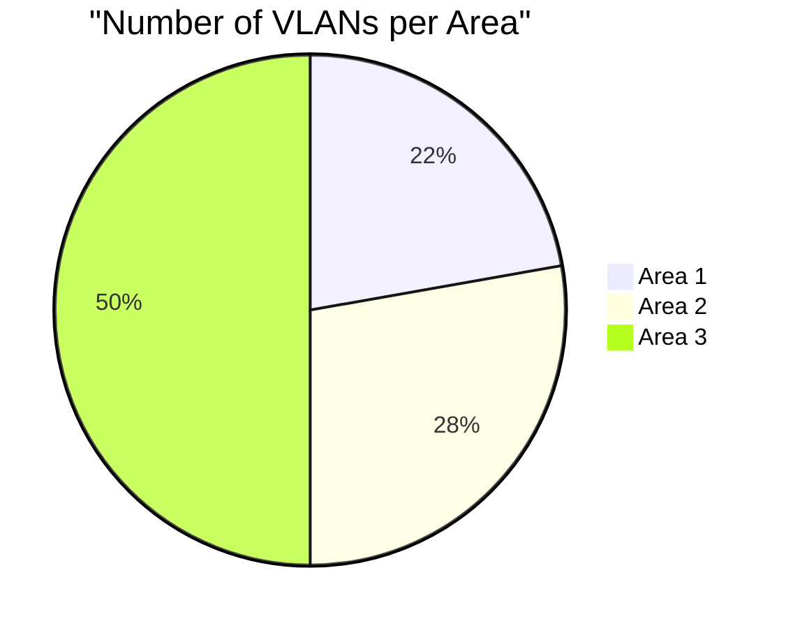
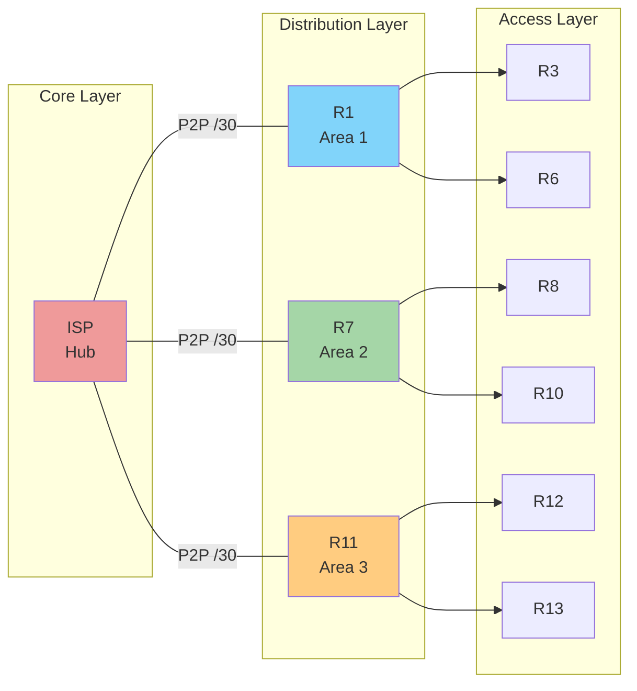
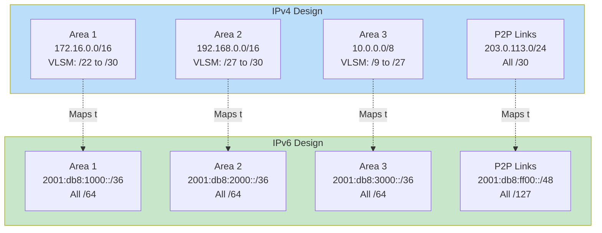

# Network Diagrams - Mermaid Format

These diagrams render automatically in GitHub, VS Code (with Mermaid extension), and many other tools.

## Network Overview

---

## IPv4 Network Topology - Area 1 Detail

---

## IPv4 Network Topology - Area 2 Detail

---

## IPv4 Network Topology - Area 3 Detail

---

## IPv6 Network Overview

---

## Complete Network Hierarchy

---

## VLAN Distribution Across Areas

---

## Router Interconnection Map

---

## IPv4 vs IPv6 Comparison

---

## Viewing Instructions

### In VS Code:
1. Install "Markdown Preview Mermaid Support" extension
2. Open this file
3. Press `Ctrl+Shift+V` (or `Cmd+Shift+V` on Mac) for preview

### In GitHub:
- These diagrams render automatically when viewing this file on GitHub

### Online Viewer:
- Visit: https://mermaid.live/
- Copy/paste any diagram code

### Export as Image:
1. Go to https://mermaid.live/
2. Paste diagram code
3. Click "Download PNG" or "Download SVG"

---

## Customization

To modify these diagrams:
1. Edit the text between the triple backticks
2. Adjust node names, labels, or connections
3. Change colors with `style` commands
4. Add new nodes or subgraphs as needed

Mermaid syntax guide: https://mermaid.js.org/

---

*Generated: October 26, 2025*

